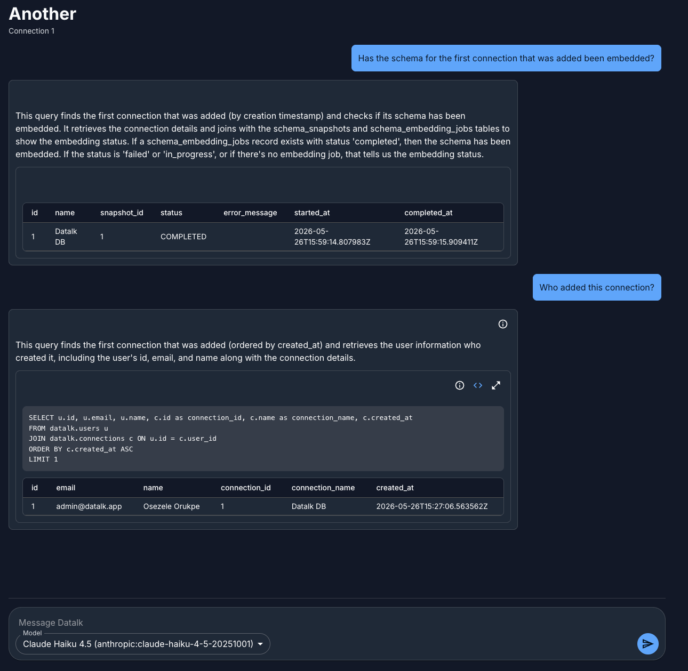

# Datalk

Datalk is a self-hosted data chat application. It lets users connect databases, refresh schema metadata, configure LLM providers, and ask natural-language questions that are translated into SQL and rendered back as chat responses.

The project is built as a Go backend plus a React frontend. For local development they can run separately, while production-style builds serve the React app and the API from one Go binary.

For a detailed backend design overview, see [ARCHITECTURE.md](ARCHITECTURE.md).



## Features

- Initial owner setup flow for new installations.
- JWT-based authentication with access and refresh tokens.
- User management for owner/admin users.
- Role-aware connection access:
  - owners/admins can manage and see all connections.
  - members can see connections explicitly granted to them.
- Database connection management with encrypted DSNs.
- Schema snapshot refresh and schema embedding.
- Provider configuration management with encrypted API keys.
- Chat conversations backed by provider/model selection.
- SQL generation and execution against configured connections.
- React Material UI frontend with light/dark/system theme support.
- Mobile-responsive app layout.
- Single-binary production-style serving for frontend + backend.

## Repository Layout

```text
.
├── apps
│   ├── backend                 Go API, services, DB migrations, Echo server
│   │   ├── cmd/api              Backend entrypoint
│   │   ├── db                   Migrations, generated Bob models, DB helpers
│   │   ├── docs                 API docs and Postman collection
│   │   ├── servers/echo         HTTP routing, handlers, static web serving
│   │   └── services             users, connections, schemas, chat
│   └── web                      React + Vite + Material UI frontend
├── docs                         Project docs
├── Dockerfile                   Multi-stage release image
├── Makefile                     Cross-app build/release targets
└── frontend_steps.md            Frontend implementation plan/history
```

## Requirements

- Go 1.25.x
- Node.js 22.x or a recent compatible Node release
- npm
- Docker, for the local Postgres stack and release image builds
- Postgres with pgvector, or the provided Docker Compose database
- Ollama, for schema embedding with `nomic-embed-text`

## Configuration

The backend loads configuration from environment variables. In local development, `apps/backend/.env` is loaded automatically by `github.com/joho/godotenv/autoload` and by the backend `Makefile`.

Required backend variables:

```env
APP_NAME=datalk
APP_ENV=production
PORT=8007

DB_NAME=datalk
DB_HOST=127.0.0.1
DB_PORT=5437
DB_USER=datalk_admin
DB_PASSWORD=postgres
DB_SSLMODE=disable
DB_SCHEMA=datalk
GO_MIGRATE_TABLE=schema_migrations

JWT_SECRET=replace-with-a-long-random-secret
JWT_ISSUER=datalk
PROVIDER_CONFIG_SECRET=replace-with-a-32-byte-or-strong-secret
```

Optional auth and embedding tuning variables:

```env
JWT_ACCESS_TTL=15m
JWT_REFRESH_TTL=720h
REDIS_URL=

OLLAMA_BASE_URL=http://localhost:11434
EMBEDDING_BATCH_SIZE=16
EMBEDDING_TIMEOUT=30s
EMBEDDING_MAX_RETRIES=3
EMBEDDING_CONCURRENCY=1
```

`EMBEDDING_ENABLED` defaults to `true` and should remain enabled for normal application use.

Migration commands also expect `DB_HOSTNAME`. For local development this usually matches `DB_HOST`:

```env
DB_HOSTNAME=127.0.0.1
```

Security notes:

- `JWT_SECRET` signs auth tokens. Use a strong unique secret.
- `PROVIDER_CONFIG_SECRET` encrypts provider API keys and database DSNs. Treat it as durable production secret material. Losing or changing it can make existing encrypted values unreadable.
- Do not commit `.env`.

## Local Database

The backend includes a Docker Compose file for Postgres + pgvector:

```sh
cd apps/backend
make docker-up
```

This starts Postgres on host port `5437` by default and initializes the `datalk` schema and pgvector extension.

## Local Development

For day-to-day frontend work, run the backend and frontend separately. This gives the frontend Vite hot reload while the backend serves the API.

Terminal 1:

```sh
cd apps/backend
make all
make run
```

Terminal 2:

```sh
cd apps/web
npm install
VITE_API_PROXY_TARGET=http://localhost:8007 make dev
```

Open:

```text
http://localhost:5173
```

Vite proxies `/api` calls to the backend URL from `VITE_API_PROXY_TARGET`.

## Production-Style Single Binary

From the repository root:

```sh
make single-binary
```

This target:

1. Builds the React app into `apps/web/dist`.
2. Copies the built frontend into `apps/backend/servers/echo/staticweb/dist`.
3. Builds `apps/backend/datalk-api`.

Run the combined app:

```sh
cd apps/backend
./datalk-api --try-migrate
```

Open:

```text
http://localhost:8007
```

The backend serves:

- API routes under `/api/*`
- the React app for non-API routes
- frontend static assets under `/assets/*`

Generated frontend assets are ignored by git. The backend static embed directory keeps only a placeholder tracked so Go builds/tests can compile before real frontend assets are generated.

## Docker Release Build

Build a release image:

```sh
make docker-release
```

The root `Dockerfile` is multi-stage:

1. Node stage installs frontend dependencies and builds `apps/web/dist`.
2. Go stage copies the built frontend into the backend embed directory and builds `datalk-api`.
3. Runtime stage contains only the compiled binary and runtime certificates/libraries.

Run the image with the required environment variables:

```sh
docker run --rm \
  --env-file apps/backend/.env \
  -p 8007:8007 \
  datalk:latest
```

The database must be reachable from inside the container. If using the Compose database from the host, adjust `DB_HOST` accordingly, for example to a Docker network service name or host gateway address.

## Make Targets

Repository root:

```sh
make web-install      # install frontend dependencies
make web-build        # build apps/web into apps/web/dist
make web-copy-assets  # build frontend and copy assets into backend embed dir
make single-binary    # build frontend assets and backend datalk-api binary
make docker-release   # build datalk:latest Docker image
```

Backend:

```sh
cd apps/backend
make all              # build datalk-api
make run              # run ./datalk-api --try-migrate
make docker-up        # start local Postgres stack
make test             # go test -v ./...
make fmt              # format Go files with gofumpt
make generate         # go generate ./... and format
make generate-models  # regenerate Bob DB models
```

Frontend:

```sh
cd apps/web
make install
make dev
make build
make typecheck
make lint
make test
```

## Testing

Frontend checks:

```sh
cd apps/web
npm run typecheck
npm run lint
npm run test -- --run
npm run build
```

Backend checks:

```sh
cd apps/backend
go test ./servers/echo/... ./cmd/api/...
go test ./...
make test
```

Some backend tests use local Postgres through the test runner and migrations. Redis-backed tests may skip or warn when `REDIS_URL` is not configured.

## API Documentation

The API reference lives in:

- `apps/backend/docs/API_ENDPOINTS.md`
- `apps/backend/docs/datalk-api.postman_collection.json`

The API uses `/api` as its root prefix. Public auth routes include setup, login, and refresh. Most other routes require:

```http
Authorization: Bearer <access_token>
```

## First-Run Flow

On a fresh installation:

1. Open the app.
2. If no owner/admin exists, the setup page is shown.
3. Create the owner account.
4. Set up a database connection.
5. Add provider configuration.
6. Start a conversation.

After setup, normal login is used.

## Schema Embedding and Ollama

Schema embedding is required for chat context retrieval, and Ollama is currently the supported embedding backend.

Make sure Ollama is running and the embedding model is available:

```sh
ollama pull nomic-embed-text
```

Keep `EMBEDDING_ENABLED=true` for normal application use. Provider configs can still point chat generation to Ollama or remote providers, depending on the configured provider/model.

## TODO

- ~~Natural-language assistant responses, so chat answers can include a plain-English explanation in addition to SQL results.~~
- Admin password reset flow for users, including forced password change on next login.
- ~~Streaming chat responses for better perceived latency during SQL generation and result explanation.~~
- Conversation rename/delete/archive actions.
- ~~Connection health checks from the UI before saving or after editing a connection.~~
- Schema refresh progress and status indicators in the frontend.
- Production Docker Compose example covering the app container, Postgres, pgvector, and Ollama.
- CI pipeline for frontend checks, backend tests, single-binary build, and Docker image build.
- More granular connection permissions, for example read-only query access versus connection management.

## Troubleshooting

### `connect: connection refused` for Postgres

Start the database:

```sh
cd apps/backend
make docker-up
```

Then confirm `.env` points to the right host and port.

### Frontend API calls go to the wrong backend

When using Vite, set:

```sh
VITE_API_PROXY_TARGET=http://localhost:8007 make dev
```

When using the single binary, open the backend origin directly, usually:

```text
http://localhost:8007
```

### Go build fails because embedded frontend files are missing

For production-style verification, run:

```sh
make single-binary
```

For backend-only development, the tracked placeholder in `apps/backend/servers/echo/staticweb/dist` keeps the embed package compilable.
